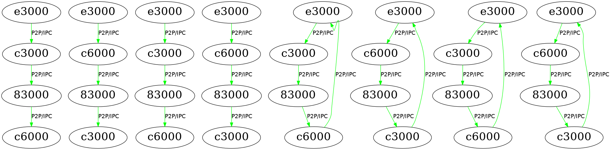

# NCCL/RCCL Log Processor

This tool is used to collect RCCL collective traces, visulize topologies for rings and trees in RCCL, and get device grouping information. 

## Requirement 
The tool currently works for applications with RCCL 2.9 or above. However, the collective trace processor function works for an application without multiple device groups in RCCL 2.8 or below.

From ROCm 4.3:
NCCL_DEBUG=INFO NCCL_DEBUG_SUBSYS=INIT,COLL only enable collective API trace. Collective trace mode is enabled separately by RCCL_KERNEL_COLL_TRACE_ENABLE=1 which has the outputs in the new format as below:
```
[0] NCCL INFO ## [1703255.821541] [01:00] 000035 KL HWID 4230c540 AllReduceTreeLLSum_f32 nt 256 bi 0 nc 1 busId C3000
```
**Run application and collect RCCL/NCCL Log:**

```
NCCL_DEBUG=INFO NCCL_DEBUG_SUBSYS=INIT,COLL,GRAPH RCCL_KERNEL_COLL_TRACE_ENABLE=1 <application> |& tee nccl_debug_log.txt
```
**Run the installation script to meet the requirements of this tool:**

```
sh install.sh
```

## Usage
For more information about RCCL collective traces, please go to [here](https://confluence.amd.com/display/MLSE/RCCL+Collective+Trace).

Example command lines:
```shell
python log_processor.py --rccl-debug-log gpt2_rccl_mp4_log_newPR.txt
```
Notice that since NCCL and RCCL 2.8 or below has no sufficient inforamtion for device grouping, "--cuda" flag needs to be specified and the number of devices used in the application is also required.
```shell
python log_processor.py --rccl-debug-log base_2.8.log --cuda --num_devices 8
```

## Example Output
If ROCm 2.8 or above is used, there will be multiple RCCL topology graphs, time tables for each RCCL operations and devices, bandwidth tables for each RCCL operations and devices, and a text file which contains device grouping information. </br>
For example, if there are 6 device groups in an application, there will be 12 (=6*2) output tables in csv files. The numbering of the tables is followed by the line number in device_groups.txt.

 


## Copyright
All source code and accompanying documentation are copyright (c) 2019-2020 Advanced Micro Devices, Inc. All rights reserved.
